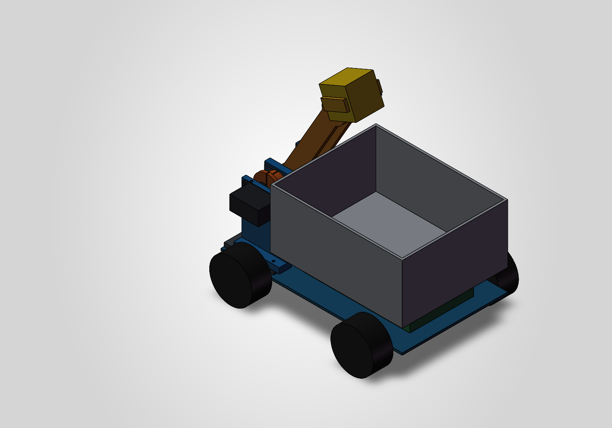

# CRTC2026 双车机器人项目

上层车推送黄块，下层车使用翻转臂和夹爪收集、接料。项目背景与当前决策见 [PROJECT.md](PROJECT.md)。

## 最新机械设计

### 翻转臂与料仓 v3（2026-09-21）

根据实物舵机照片补充MG995、SG90外形和安装托架，提供夹取、抬升、投料三个姿态。

- [完整CAD文件包](output/mechanics/flip-arm-sw-v3/FlipArm_V3_photo_fit.zip)
- [投料姿态STEP](output/mechanics/flip-arm-sw-v3/FlipArm_V3_deposit.STEP)
- [SolidWorks装配](output/mechanics/flip-arm-sw-v3/FlipArm_V3_deposit.SLDASM)
- [尺寸、照片依据和修改说明](output/mechanics/flip-arm-sw-v3/README.md)
- [舵机实物参考照片](pic/)

原生文件使用SolidWorks 2026；下载ZIP并完整解压后打开SLDASM，保留同目录零件依赖。其他CAD软件可尝试STEP。当前为装配草案，SG90至夹指的传动、托架至腕部的连接尚未完成，不能把参考舵机和轴承模型作为打印零件。

### 桥梁试验模型

- [带两端高台的完整文件包](output/mechanics/bridge-platforms-v2/Bridge_with_platforms_TEST.zip)
- [带高台STEP](output/mechanics/bridge-platforms-v2/Bridge_with_platforms_TEST.STEP)
- [桥梁模型说明](output/mechanics/bridge-platforms-v2/README.md)
- [单段桥板模型与说明](output/mechanics/bridge-test-v1/README.md)

模型用于150mm桥面通行试验；桥曲线、厚度及净空解释包含假设，不能视为官方场地精确复刻。

## 文件位置

| 目录/文件 | 内容 |
|---|---|
| `output/mechanics/flip-arm-sw-v3/` | 当前舵机照片适配版本 |
| `output/mechanics/flip-arm-sw-v1/`、`flip-arm-sw-v2/` | 历史机械臂版本与生成脚本 |
| `output/mechanics/bridge-platforms-v2/` | 带高台的桥梁装配 |
| `output/power/`、`output/signals/` | 供电与信号方案 |
| `pic/` | 实物尺寸参考照片 |
| `PROJECT.md` | 项目背景、设计决策、工作流程和验收边界 |

CAD目录中的`build.ps1`、`build.cs`为本机SolidWorks API生成脚本；模板和API路径按本机安装配置。重新生成会覆盖相应输出，应先备份并阅读该目录说明。`backups/`、`tmp/`以及BMP预览中间文件作为本地工作资料，新文件不纳入Git。
